# npm 全局命令行 自动生成博客gh-pages分支的展示页~c~

### 1.下载运行：

* `git clone  地址`
* `npm install . -g`本地安装
* 在要提交的文件下 输入命令`ccpage --init`或`ccpage -i`

### 2.特别注意：

#### 2.1当前目录：

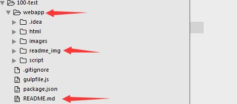

* 当前要转化的目录必须有webapp文件夹、webapp/readme_img文件夹、readme.md文件，大小写均可。

#### 2.2readme.md：

* 题头必须是`#`加空格，后面为题头，末尾为下图：

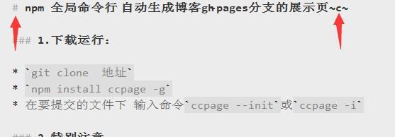

* 为配合我自己写的展示页的样式，每段的标头为`###`空格加标头：
* 段落下的小标题为`####`空格加标头：
* 有微调的地方也可以用[原版天书](https://github.com/tianmajs/tianshu)进行修改：

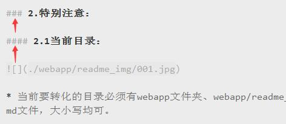

* 尽量每段话、标题、图片之间有换行，自己在敲的时候也好看，生成的页面也舒服：

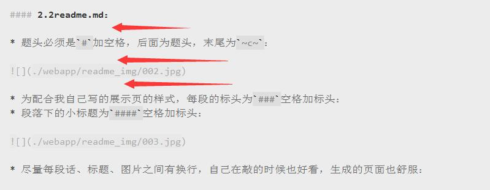

### 3.ccpage -i：

#### 3.1生成目录：

* 生成的目录及后台打印的log：

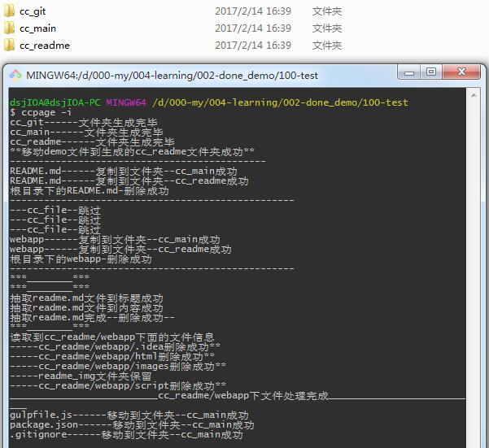

#### 3.2生成主目录：

* 所有的文件操作在./lib/module/file.js里，自己已经习惯所有的前端代码都是面向对象，所有这里也用面向对象实现所有的核心操作：

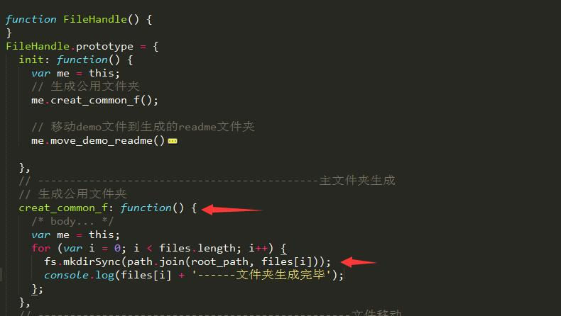

* 这里要大量的进行fs文件操作，采用fs-extra第三方包非常有助于我们实现业务逻辑，因为几乎很多操作都是异步进行，所以这里也采用promise规范进行包装，我用的是bluebird第三方包。没有用过这两个包的同学可以先去学习下：

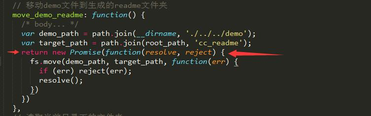

#### 3.2业务逻辑：

* 具体的可看代码，大神过。
* 首先是形成主目录，这里解释下为什么要形成这三个目录，因为本人的每个项目都喜欢在写完后写一个说明文档。每次提交到github上都需要建三个文件夹。git用于提交的地方，main放入自己写的全部文件及依赖，readme文件夹用于存放展示页。
* 我这里加了个前缀 cc_ 没有什么特别含义。我叫cc。嘿嘿~
* 生成这三个文件夹后，进行下面的移动：红色为我们写的全部文件移动到main文件夹，蓝色的线我们要提交到gh-pages分支上的展示文件。

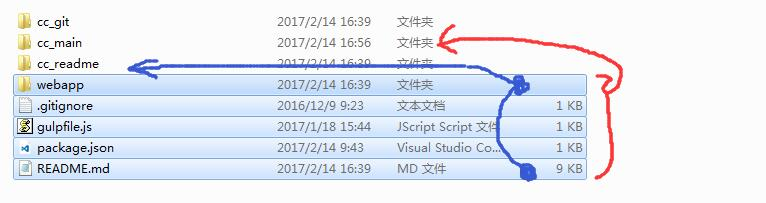

* 移动提交到gh-pages分支上的模板文件：

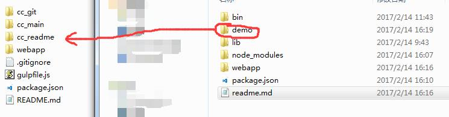

* 代码部分webapp和readme.md文件要分别移动到这两个文件夹，同步复制指定文件夹，移动完成后删除原来的文件。其他文件或文件夹直接移动到main下面。

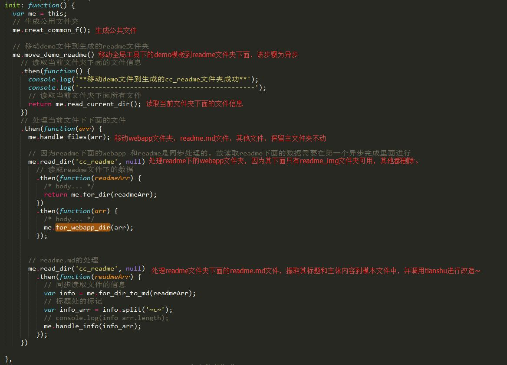

#### 3.3天书改造：

* 全局包变第三方包：

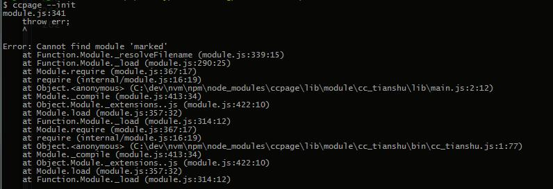

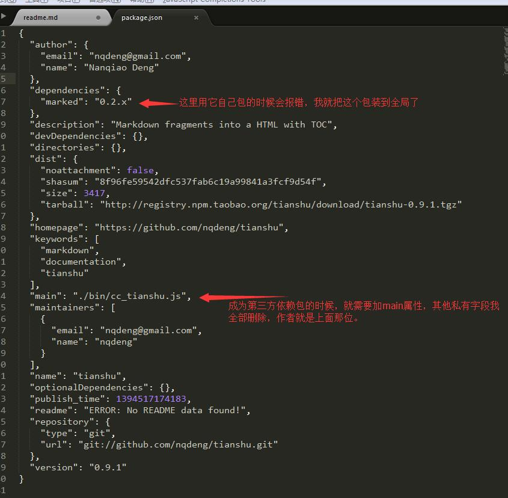

#### 3.3效果展示：

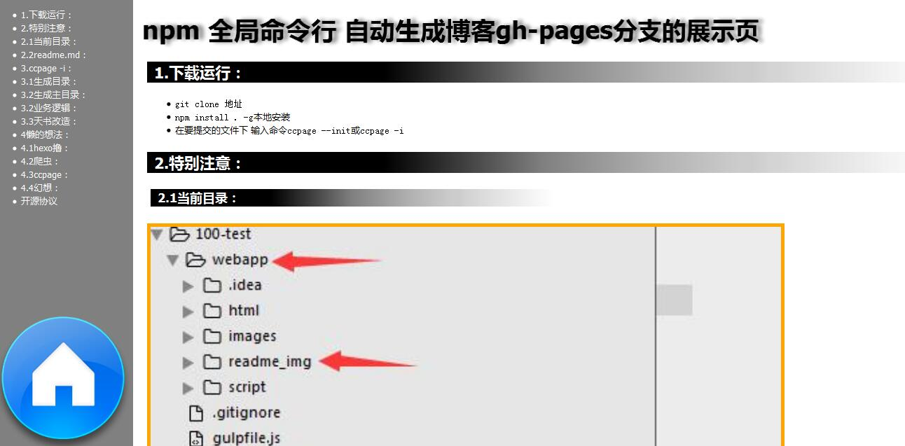

### 4懒的想法：

#### 4.1hexo撸：

* 前几天是自己用exo博客搭建工具撸了一个博客，里面有个文件夹是用于存放博客上的文章的所有的md文件夹，这个文件夹说实话就是存在博客的所有文章的地方。我觉得很乱，又不喜欢再这个文件夹里面撸，于是~~~~

#### 4.2爬虫：

* 由于我的github上每个项目都习惯用一个gh-pages分支进行说明页展示，因此每个项目都有一个展示的地址。我就写了个爬虫，把仓储中所有的项目形成每个md文件爬到博客存放md文件的地方。感觉这样确实挺对的，我没有必要把所有的文章放在一起管理，又乱，看起来麻烦，每个项目都有自己的展示页，我只需要链接过去就行了。

#### 4.3ccpage：

* 接下来就是对自己写的所有项目进行提交前的创建文件夹，也是为了方便提交，看起来舒服点。因为每次写代码都是按照那样写，写完后为了提交方便又会变成现在这样的主文件夹（3个）的状态。于是ccpage全局命令行工具就撸出了。最后直接把天书的功能融合进去了。只要按照前面的要求写，出来的展示页还是很漂亮的。

#### 4.4幻想：

* 其实我想一次性运行行代码就把我想完成的工作全部完成，现在还是不知道怎么实现，因为我还得：

```
    * ccpage进行要提交的目录的生成
    * 本地提交项目到github
    * 爬虫到博客管理md文件夹里
    * 部署博客
```

* 看...还得进行四次命令...


